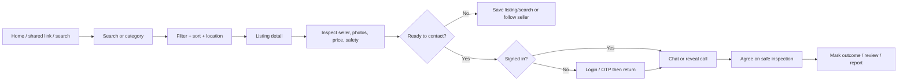
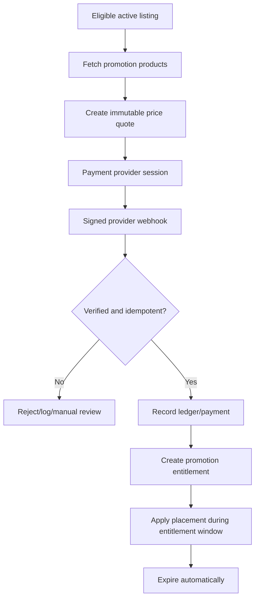
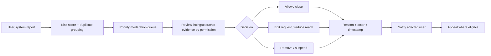
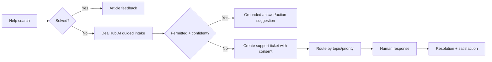

# 2. Information Architecture, Sitemap, and User Flows

## 2.1 Navigation model

DealHub uses four coordinated navigation layers:

1. **Global:** brand, search, category, location, language, login/register, Sell Now.
2. **Category:** horizontally scrollable root categories; category data is API-driven.
3. **Contextual:** breadcrumbs, filters, sort, listing actions, dashboard sidebar.
4. **Mobile:** task-based bottom navigation for Home, Browse, Sell, Chats, Profile; secondary links live in the drawer.

Search remains the primary discovery action. Sell remains visually distinct in gold. Violet represents primary interactive state; gold is not used for ordinary competing actions.

## 2.2 Sitemap

```mermaid
flowchart TD
  ROOT[DealHub]
  ROOT --> HOME[Home]
  ROOT --> DISCOVER[Discover]
  DISCOVER --> SEARCH[Search results]
  DISCOVER --> CAT[Category landing]
  CAT --> SUB[Subcategory landing]
  DISCOVER --> LISTING[Listing details]
  LISTING --> SELLER[Public seller/store]
  ROOT --> AUTH[Account access]
  AUTH --> LOGIN[Log in]
  AUTH --> SIGNUP[Create account]
  AUTH --> OTP[Verify email/phone]
  AUTH --> RECOVERY[Password recovery]
  ROOT --> SELL[Sell]
  SELL --> DRAFT[Post/edit listing]
  DRAFT --> PREVIEW[Preview]
  PREVIEW --> PAYMENT[Fee/promotion checkout]
  ROOT --> CUSTOMER[Customer dashboard]
  CUSTOMER --> SAVED[Saved listings/searches]
  CUSTOMER --> MESSAGES[Messages/calls]
  CUSTOMER --> FOLLOWING[Following/reviews]
  CUSTOMER --> C_PAY[Payments/promotions]
  CUSTOMER --> PROFILE[Profile/preferences]
  ROOT --> SELLER_D[Seller dashboard]
  SELLER_D --> INVENTORY[Listings/inventory]
  SELLER_D --> INQUIRIES[Inquiries/chat]
  SELLER_D --> ANALYTICS[Listing analytics]
  SELLER_D --> STORE[Store/verification]
  SELLER_D --> PROMOTE[Promotions/payments]
  ROOT --> ADMIN[Admin dashboard]
  ADMIN --> USERS[Users/roles/verification]
  ADMIN --> TAXONOMY[Categories/attributes]
  ADMIN --> MOD[Listings/reports/moderation/reviews]
  ADMIN --> COMMERCIAL[Fees/promotions/ads/payments]
  ADMIN --> SUPPORT[Support/notifications/AI]
  ADMIN --> CONFIG[Languages/settings/audit]
  ADMIN --> BI[Analytics/revenue]
  ROOT --> HELP[Help & safety]
  HELP --> TICKETS[Support tickets]
```

## 2.3 Canonical route plan

| Route pattern | Access | SEO | Purpose |
|---|---|---|---|
| `/` | Public | Index | Homepage |
| `/search?q=&category=&city=` | Public | Conditional | Search results |
| `/category/:categorySlug` | Public | Index | Root/subcategory landing |
| `/listing/:listingId/:listingSlug` | Public | Index while active | Stable listing detail URL |
| `/seller/:sellerId/:storeSlug` | Public | Index | Public seller/store profile |
| `/sell`, `/sell/:listingId/edit` | Seller | Noindex | Create/edit listing |
| `/login`, `/register`, `/verify`, `/recover` | Guest | Noindex | Account access |
| `/dashboard/*` | Customer | Noindex | Customer workspace |
| `/seller/*` | Seller | Noindex | Seller workspace |
| `/admin/*` | Authorized staff | Noindex | Admin workspace |
| `/messages/:conversationId?` | Authenticated | Noindex | Conversations |
| `/help/:articleSlug?` | Public | Index | Help and safety content |

The Phase 1 preview uses `/browse` as its search/results route. Before public launch, introduce canonical redirects between `/browse` and `/search` if `/search` becomes canonical.

## 2.4 Buyer flow

Critical rules: preserve query/filter state after login and Back; never expose sensitive contact data in page HTML; show safety guidance near contact actions; provide block/report throughout chat.

## 2.5 Seller listing flow

```mermaid
flowchart LR
  START[Sell Now] --> AUTH{Authenticated seller?}
  AUTH -- No --> ACCESS[Login/signup + role consent]
  AUTH -- Yes --> CATEGORY[Select category]
  ACCESS --> CATEGORY
  CATEGORY --> ATTR[Category attributes + title + description]
  ATTR --> MEDIA[Upload, reorder, alt text, checks]
  MEDIA --> LOCATION[Approximate public location]
  LOCATION --> PREVIEW[Preview + policy checks]
  PREVIEW --> POLICY{Fee required?}
  POLICY -- No --> SUBMIT[Submit for moderation]
  POLICY -- Yes --> CHECKOUT[Configured checkout]
  CHECKOUT --> SUBMIT
  SUBMIT --> STATUS[Pending / active / rejected]
  STATUS --> MANAGE[Edit, promote, mark sold, renew, archive]
```

Drafts autosave against a revision. Submission is idempotent. Price/free-limit decisions come from a server quote, not client constants. Media is uploaded directly to signed object-storage URLs and attached only after validation.

## 2.6 Promotion/payment flow

Frontend return URLs never activate an entitlement. Only verified server-to-server payment confirmation can do so.

## 2.7 Report and moderation flow

Moderator access to private evidence is purpose-limited and audited. Financial and super-admin actions require separate permissions.

## 2.8 Support and AI escalation flow

AI cannot issue refunds, approve verification, moderate users, activate payments, or reveal private data. It can prepare a draft or invoke allow-listed server tools requiring normal authorization and confirmation.

## 2.9 Admin change propagation

Category, fee, ad, language, and feature configuration follows: admin draft → validation/preview → publish with version → audit event → cache invalidation → API response update. Clients use stable IDs and tolerate unknown fields/icons with fallbacks.
